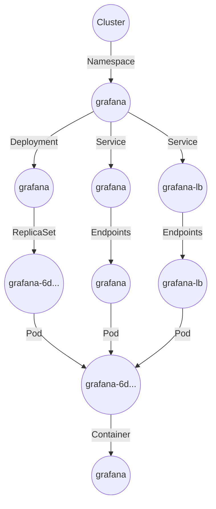

```mermaid
graph
  a9523b79-3f73-00b6-b2a8-000fe621f396((grafana)):::Container
  e6bdaa04-780e-cf2a-a462-45f4f0a6c473((Cluster)):::Cluster
  3d37f5d5-326e-0c92-2576-760db20c0d3d((grafana)):::Namespace
  6862a16e-842f-4e47-9f22-172a18a92cbe((grafana-6d...)):::Pod
  16246790-3ad5-46a2-8535-e0eb9a399243((grafana-6d...)):::ReplicaSet
  4f7968cb-4607-418d-91c1-8647b657929b((grafana)):::Service
  c720add2-986f-4f79-ac43-1fecb7c1449d((grafana)):::Endpoints
  ab3a5063-0959-428b-82d9-34236756bdb6((grafana-lb)):::Service
  0d25ed4b-a8b4-417f-a3a7-fc0f01d4ba53((grafana-lb)):::Endpoints
  875d484d-9a26-4b8a-b459-ca23c2259777((grafana)):::Deployment
  4f7968cb-4607-418d-91c1-8647b657929b -- Endpoints --> c720add2-986f-4f79-ac43-1fecb7c1449d
  ab3a5063-0959-428b-82d9-34236756bdb6 -- Endpoints --> 0d25ed4b-a8b4-417f-a3a7-fc0f01d4ba53
  e6bdaa04-780e-cf2a-a462-45f4f0a6c473 -- Namespace --> 3d37f5d5-326e-0c92-2576-760db20c0d3d
  3d37f5d5-326e-0c92-2576-760db20c0d3d -- Service --> ab3a5063-0959-428b-82d9-34236756bdb6
  3d37f5d5-326e-0c92-2576-760db20c0d3d -- Deployment --> 875d484d-9a26-4b8a-b459-ca23c2259777
  16246790-3ad5-46a2-8535-e0eb9a399243 -- Pod --> 6862a16e-842f-4e47-9f22-172a18a92cbe
  c720add2-986f-4f79-ac43-1fecb7c1449d -- Pod --> 6862a16e-842f-4e47-9f22-172a18a92cbe
  0d25ed4b-a8b4-417f-a3a7-fc0f01d4ba53 -- Pod --> 6862a16e-842f-4e47-9f22-172a18a92cbe
  875d484d-9a26-4b8a-b459-ca23c2259777 -- ReplicaSet --> 16246790-3ad5-46a2-8535-e0eb9a399243
  3d37f5d5-326e-0c92-2576-760db20c0d3d -- Service --> 4f7968cb-4607-418d-91c1-8647b657929b
  6862a16e-842f-4e47-9f22-172a18a92cbe -- Container --> a9523b79-3f73-00b6-b2a8-000fe621f396
```

